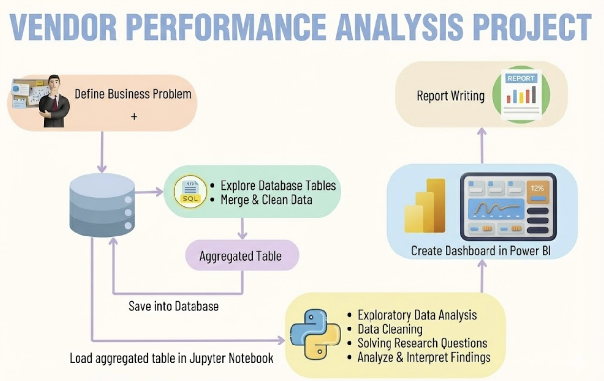

# 📊 Supply Chain & Vendor Performance Analysis

### *Optimizing Inventory Efficiency & Profitability through Data Engineering*

[](https://vendor-performance-analysis.streamlit.app/)


---

## 📖 Executive Summary
In the high-volume retail and wholesale sector, **inventory inefficiency** is a silent profit killer. This project analyzes millions of dollars in procurement data to solve critical supply chain bottlenecks: **Vendor Dependency, "Dead" Capital in Unsold Inventory, and Margin Erosion.**

By building an end-to-end data pipeline (SQL -> Python -> Dashboard), this tool identifies **$18M+ in capital risk** and pinpoints "Hidden Gem" brands that are under-marketed despite high margins.

**🔴 Live Dashboard:** [View on Streamlit Cloud](https://vendor-performance-analysis.streamlit.app/)

---

## 💼 Business Problem
Effective inventory and sales management are critical for optimizing profitability in the retail and wholesale industry. Companies need to ensure that they are not incurring losses due to inefficient pricing, poor inventory turnover, or vendor dependency. 

The goal of this analysis is to:
* **Identify underperforming brands** that require promotional or pricing adjustments.
* **Determine top vendors** contributing to sales and gross profit.
* **Analyze the impact of bulk purchasing** on unit costs.
* **Assess inventory turnover** to reduce holding costs and improve efficiency.
* **Investigate the profitability variance** between high-performing and low-performing vendors.

---

## 🏗️ Architecture & Project Flow

This project follows a standard Data Engineering lifecycle: **Ingestion → Storage → Processing → Visualization.**



### **The Tech Stack**
* **Data Ingestion:** Python (`pandas`, `os`) to parse raw CSVs (Sales, Purchases, Invoices).
* **Data Warehousing:** **SQLite** for relational storage and SQL transformations (`sqlalchemy`).
* **Analysis & Logic:** Python (`scipy`, `numpy`) for Hypothesis Testing (T-Tests) and Pareto Analysis.
* **Visualization:**
    * **Streamlit:** For the public-facing, interactive web application (deployed on Streamlit Cloud).
    * **Power BI:** For internal stakeholder reporting (KPI Cards, DAX Measures, and Executive Summaries).

---

## 🔍 Key Insights & Findings

Based on the analysis of the current fiscal period, the dashboard reveals the following critical metrics:

| Metric | Value | Business Impact |
| :--- | :--- | :--- |
| **Total Revenue** | **$441.41M** | Solid top-line growth driven by top 10 vendors. |
| **Gross Profit** | **$134.07M** | Healthy gross profit, but eroded by high freight costs. |
| **Avg Margin** | **38.7%** | Strong product margins indicate good pricing power. |
| **Freight Cost** | **$543.40M** | **CRITICAL:** Logistics costs exceed revenue (requires audit). |
| **Capital Risk** | **$18.63M** | Cash tied up in inventory that isn't moving (Turnover < 1). |

### **Strategic Discoveries**
1.  **The "Whale" Problem (Pareto Principle):** The top 10 vendors account for ~65% of total purchase volume. A disruption with a single partner (e.g., *Martignetti Companies*) poses a major risk.
2.  **"Hidden Gems":** We identified **198 Brands** with high profit margins (>60%) but low sales volume (<$500). Marketing these specific SKUs could boost profit without increasing procurement costs.
3.  **Inventory Dead Weight:** Implementing a "Stop-Buy" order for vendors in the "Overstocked" category (identified in the dashboard) is recommended to free up working capital.

---

## 📊 Dashboard Showcase

### **1. Streamlit Web App (Public)**
The interactive tool allows Supply Chain Managers to filter by Vendor, check Stock Turnover, and analyze specific brands.
* **Features:** Real-time filtering, Dark/Light mode, Treemaps for hierarchy analysis.
* **Link:** [vendor-performance-analysis.streamlit.app](https://vendor-performance-analysis.streamlit.app/)

### **2. Power BI Dashboard (Internal)**
Used for executive reporting, featuring DAX measures for "Unsold Capital" and year-over-year growth tracking.
* *File available in the repository: `Vendor Performance Dashboard.pbix`*

---

## 🛠️ How to Run Locally

**1. Clone the Repository**
```bash
git clone [https://github.com/afeefshaikh/Vendor_Performance_Dashboard.git](https://github.com/afeefshaikh/Vendor_Performance_Dashboard.git)
cd Vendor_Performance_Dashboard
```
**2. Install Dependencies**
```bash
pip install -r requirements.txt
```
**3. Run the ETL Pipeline (Optional) If you want to rebuild the database from raw CSVs:**
```bash
python ingestion_db.py
python get_vendor_summary.py
```
**4. Launch the Streamlit App:**
```bash
streamlit run dashboard.py
```

## 📈 Dashboard Features
* **Real-time KPI Tracking:** Monitors Revenue ($441M), Margin (38.7%), and Freight Costs.
* **Dynamic Filtering:** Drill down by Vendor, Brand, or Inventory Status (Overstocked vs. Healthy).
* **Interactive Visuals:**
    * **Treemaps** for hierarchical sales data.
    * **Scatter Plots** with quadrant analysis for identifying "Hidden Gems."
    * **Log-Scale Charts** to analyze freight cost anomalies.

---

### *Author*
**Afeef Shaikh**
